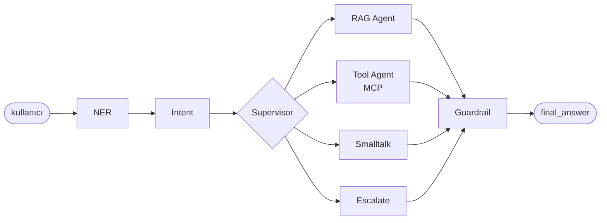

# multi-agent-banking-rag

Bir retail-banking destek asistanı için **çoklu ajan (multi-agent) mimarisi** referans
uygulaması: niyet/varlık çıkarımı, hibrit RAG (vektör + BM25), MCP üzerinden araç çağırma
ve kural tabanlı bir güvenlik katmanı — hepsi [LangGraph](https://github.com/langchain-ai/langgraph)
ile orkestre edilmiş tek bir state machine üzerinde.

> **Bu bir portföy/demo projesidir.** "DemoBank A.Ş." kurgusal bir bankadır; hesap/işlem
> verisi bellek-içi (in-memory) fixture'dır, gerçek bir çekirdek bankacılık sistemine
> bağlanmaz. Amaç, gerçek bir üründe kullanılacak kalitede bir **mimari** ve **mühendislik
> pratiği** göstermek. Neyin bilinçli olarak basitleştirildiği aşağıda ve
> [`docs/architecture.md`](docs/architecture.md)'de açıkça belirtiliyor — gizlenmiyor.

## Neden bu proje

Bankacılık destek konuşmaları tipik olarak birbirinden farklı üç şeyi karıştırır:
"bu nasıl çalışır" soruları (RAG'e uygun), "hesabımda ne var / şunu yap" istekleri
(araç çağırma + kesinlik gerektirir, halüsinasyona tahammülü yoktur) ve düz sohbet.
Bunların hepsini tek bir prompt'a sıkıştırmak yerine, her birini ayrı, test edilebilir
bir ajana bölüp aralarındaki geçişi (routing) deterministik bir supervisor'a bırakmak —
bu projenin gösterdiği temel fikir bu. Kararların gerekçeleri [`docs/decisions/`](docs/decisions/)
altında ADR formatında.

## Mimari (özet)



Detaylı diyagram, süreç sınırları ve ölçeklenebilirlik notları için → [`docs/architecture.md`](docs/architecture.md).

## Teknoloji seçimleri (özet — gerekçeler ADR'lerde)

| Alan | Seçim | Neden |
|---|---|---|
| Orkestrasyon | LangGraph | Koşullu dallanma + döngü + paylaşılan durumu birinci sınıf destekler ([ADR-001](docs/decisions/ADR-001-langgraph-orchestration.md)) |
| Rota kararı | Deterministik Python, LLM değil | Test edilebilirlik + gecikme/maliyet ([ADR-002](docs/decisions/ADR-002-supervisor-routing.md)) |
| LLM/embedding | Anthropic veya OpenAI, **anahtar yoksa deterministik fake'e düşer** | `docker compose up` sıfır konfigürasyonla çalışsın ([ADR-003](docs/decisions/ADR-003-offline-first-fake-providers.md)) |
| Retrieval | Chroma (vektör) + BM25 rerank | Türkçe finansal terimlerde tam-eşleşme + anlamsal yakınlığı birleştirir ([ADR-004](docs/decisions/ADR-004-hybrid-retrieval.md)) |
| Araç çağırma | FastMCP (ayrı süreç) + in-process fallback | Gerçek bir MCP sınırı göstermek + testlerde ağ bağımlılığından kaçınmak ([ADR-005](docs/decisions/ADR-005-mcp-tool-boundary.md)) |
| Güvenlik | Kural tabanlı guardrail, LLM değil | Guardrail'in kendisi jailbreak edilebilir bir modele bağımlı olmamalı ([ADR-006](docs/decisions/ADR-006-guardrail-not-an-llm-call.md)) |

## Hızlı başlangıç

Gerçek bir API anahtarı **gerekmez** — anahtar yoksa sistem otomatik olarak deterministik
"fake" LLM/embedding sağlayıcılarına düşer (bkz. `ADR-003`).

```bash
cp .env.example .env
docker compose -f docker/docker-compose.yml up --build
```

API `http://localhost:8000`'de ayağa kalkar (`GET /healthz`, `GET /readyz`), MCP araç
sunucusu `http://localhost:8765`'te. Bilgi tabanını doldurmak için (RAG cevaplarının
alıntı yapabilmesi için gerekli):

```bash
python scripts/seed_vectorstore.py
```

Örnek istek:

```bash
curl -X POST http://localhost:8000/chat \
  -H "Content-Type: application/json" \
  -d '{"message": "EFT limitiniz ne kadar?"}'
```

### Yerel geliştirme (Docker olmadan)

Not: Yerel sistem Python'u proje minimum sürümünden (3.11) eskiyse `langgraph`/`chromadb`
kurulmaz — bu durumda Docker akışını kullanın. 3.11+ varsa:

```bash
python3.11 -m venv .venv && source .venv/bin/activate
make install
make seed   # bilgi tabanını doldur
make dev    # http://localhost:8000, --reload
make mcp    # ayrı bir terminalde: araç sunucusu
```

## Test

```bash
make test        # pytest, tamamı LLM_PROVIDER=fake ile — API anahtarı gerekmez
make lint         # ruff
make typecheck    # mypy --strict'e yakın
```

Test piramidi: saf mantık (NER regex'leri, intent kural motoru, guardrail redaksiyonu,
supervisor routing) birim testle; `/chat` uç noktası + graph wiring entegrasyon testiyle;
tek bir uçtan-uca "EFT limiti sor → alıntılı yanıt al" akışı e2e testiyle kapsanıyor.

## API sözleşmesi

`POST /chat` → `ChatResponse` (bkz. `src/schemas/dto.py`): `answer`, `intent`,
`entities`, `citations`, `tool_calls`, `trace`, `guardrail_flags`. `trace` alanı, o turn'de
hangi ajanın çalıştığını ve ne yaptığını sırayla döker — bu demo'da bilinçli olarak
API'nin bir parçası: çoklu ajan sistemlerinde "neden bu yanıt verildi" sorusu debug'ın
merkezinde, bu yüzden izlenebilirlik sona eklenen bir özellik değil.

## Sınırlar / sonraki adımlar (bilinçli olarak bu demo kapsamı dışında bırakıldı)

- Konuşma geçmişi kalıcı değil (Redis/Postgres ile oturum yönetimi gerçek ürün için gerekli).
- `tool_agent` turn başına tek araç çağrısı yapıyor; çok adımlı planlama grafiğin döngü
  mekanizmasıyla desteklenebilir ama bu demo'da tek adım yeterli görüldü.
- LangSmith/Langfuse tracing entegrasyonu bir config anahtarı olarak var (`LANGSMITH_TRACING`)
  ama bu demo'da varsayılan kapalı.
- Kimlik doğrulama/oturum yok — `/chat` şu an herkese açık; gerçek dağıtım bir
  auth middleware'i gerektirir.

Ekip için devir notları: [`HANDOFF.md`](HANDOFF.md).
