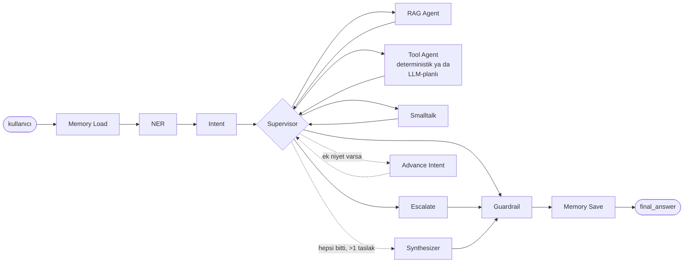

# multi-agent-banking-rag

[](https://github.com/ebraronuk/multi-agent-banking-rag/actions/workflows/ci.yml)
[](LICENSE)
[](pyproject.toml)
[](https://github.com/astral-sh/ruff)

Bir retail-banking destek asistanı için **çoklu ajan (multi-agent) mimarisi** referans
uygulaması: niyet/varlık çıkarımı, hibrit RAG (vektör + BM25), MCP üzerinden araç çağırma
ve kural tabanlı bir güvenlik katmanı — hepsi [LangGraph](https://github.com/langchain-ai/langgraph)
ile orkestre edilmiş tek bir state machine üzerinde.

> **Bu bir portföy/demo projesidir.** "DemoBank A.Ş." kurgusal bir bankadır; hesap/işlem
> verisi gerçek bir Postgres'te (bkz. `db/schema.sql`, ADR-010) ya da `DATABASE_URL`
> yoksa bellek-içi bir fixture'da yaşıyor, gerçek bir çekirdek bankacılık sistemine
> bağlanmıyor. Amaç, gerçek bir üründe kullanılacak kalitede bir **mimari** ve
> **mühendislik pratiği** göstermek. Kapsam sınırları [`docs/architecture.md`](docs/architecture.md)'de.

## Bu projeyi nasıl denetledim

Kod yazmak bitince iş bitmiş sayılmıyor. Bu projeyi kendi ürününe şüpheci bakan bir
mühendis gibi tekrar tekrar okuyup çalıştırdım; aşağıdakiler o denetimlerde bulunan,
canlı doğrulanmış, gerçek bug'lar — gömülü değil, burada:

- **Türkçe Unicode hatası**: Python'ın `str.lower()`'ı büyük "İ"yi düz "i" yerine
  "i" + görünmez bir combining-dot karakterine çeviriyor — "İ" ile başlayan (Türkçe'de
  her cümlenin başı) hiçbir mesaj anahtar-kelime eşleşmesini tutturamıyordu.
  `nlp/text_utils.py::turkish_lower()` ile düzeltildi, repodaki her `.lower()` çağrı
  noktasına yayıldı.
- **Sızan alt-sorgu**: "Kartımı blokla ve EFT limitiniz ne kadar?" gibi bileşik bir
  mesajda RAG retrieval sorgusu kart-blokaj kelimeleriyle kirlenip modelin yanlış bir
  rakam uydurmasına yol açıyordu (gerçek KB değeri 50.000 TL iken 100.000 TL dediği
  görüldü). `advance_intent_node` artık alt-niyete geçerken sadece ilgili kısmı izole
  ediyor — bkz. [ADR-012](docs/decisions/ADR-012-multi-intent-dispatch.md).
- **Guardrail false-positive'i**: prompt-injection koruması "Müşteri temsilciniz
  kurallarını unutarak yanlış bilgi verdi" gibi gerçek bir şikayet cümlesini injection
  sanıp reddediyordu — tam da bu korumanın en çok işlemesi gereken şikayet akışında.
- **Paraphrase recall'ı %46'dan %90'a**: rule-based niyet sınıflandırıcı, aynı isteğin
  10 farklı doğal ifadesinden sadece ~5'ini doğru sınıflandırıyordu (ESCALATE'te 10'da
  1'e kadar düşüyordu) — anahtar kelime kapsamı genişletilip ölçüldü.

Ayrıca `/chat`'in dayanıklılık iddiaları (ADR-007) uçtan uca test edildi: bir bağımlılık
(Postgres, LLM sağlayıcısı) konuşma ortasında patlarsa sistem hâlâ 200 dönüyor mu,
gerçekten kanıtlandı — bkz. `tests/integration/test_chat_api.py`.

## Ne yapar bu sistem?

Kullanıcı `/chat`'e bir mesaj gönderir; sistem mesajı okur, **hangi tür istek olduğuna
kendi karar verir** ve dört yoldan birine yönlendirir — kullanıcı hangi düğmeye
basacağını seçmez, hepsi tek bir uç nokta:

| Kullanıcı ne yazarsa | Sistem ne yapar |
|---|---|
| "EFT limitiniz ne kadar?" | Bilgi tabanından arar, **kaynak göstererek** cevaplar (RAG) |
| "Kartımı blokla" | Gerçek bir işlem aracı çağırır (mock banking API) — eksik bilgi varsa **sorar ve hatırlar** |
| "Merhaba" | Doğal, kısa bir sohbet yanıtı verir |
| "Yarın hava nasıl olacak?" | Kapsam dışı olduğunu söyler / insana yönlendirir |

### Somut bir senaryo: kartı bloke etmek (uçtan uca, canlı test edildi)

```
👤  Kartımı blokla
🤖  Bu işlemi gerçekleştirebilmem için kartınızın son 4 hanesine ihtiyacım var.

👤  4321
🤖  Kartınızı bloke ettim.
```

İkinci mesaj tek başına ("4321") hiçbir bağlam olmadan anlamsız bir sayı — sistemin
bunu "birinci mesajın cevabı" olarak anlayabilmesinin tek nedeni **konuşma hafızası**
(Redis, `agents/memory.py`): birinci turda "kartı blokla ama hangi kart belli değil"
bilgisi saklanıyor, ikinci turda bu bilgi geri yükleniyor, "4321"in tam olarak
beklenen cevap olduğu anlaşılıyor ve `block_card` aracı gerçekten çağrılıyor —
kullanıcı isteğini tekrar en baştan yazmak zorunda kalmıyor. Ayrıntı: ADR-008.

### Daha karmaşık bir istek (gerçek bir LLM anahtarı bağlıyken)

"Kartımı blokla **ve** bir destek talebi de aç" gibi bileşik bir istekte, model
`bind_tools` ile hangi araçları hangi sırayla çağıracağına kendisi karar verir (gerçek
akıl yürütme/planlama) — ama parayı/kartı etkileyen hiçbir aracı, o bilginin
konuşmada gerçekten geçtiğini doğrulamadan çalıştırmaz (model "9999" gibi bir kart no
uydurursa reddedilir). Ayrıntı: ADR-009. `LLM_PROVIDER=fake` modunda (anahtarsız) bu
yol yerine daha basit, deterministik bir eşleme çalışır — ikisi de test edilmiş.

### Kapsam dışı bırakılanlar (bilinçli)

Bu bir **canlı bankacılık sistemi değil** — gerçek para hareket etmez, gerçek bir
çekirdek bankacılık API'sine bağlanmaz. Amaç, bu tür bir sistemin **mimarisini**
(çoklu ajan orkestrasyonu, RAG, tool-calling, konuşma hafızası, güvenlik katmanı)
gerçek, çalışan, test edilmiş kodla göstermek.

## Neden bu proje

Bankacılık destek konuşmaları tipik olarak birbirinden farklı üç şeyi karıştırır:
"bu nasıl çalışır" soruları (RAG'e uygun), "hesabımda ne var / şunu yap" istekleri
(araç çağırma + kesinlik gerektirir, halüsinasyona tahammülü yoktur) ve düz sohbet.
Bunların hepsini tek bir prompt'a sıkıştırmak yerine, her birini ayrı, test edilebilir
bir ajana bölüp aralarındaki geçişi (routing) deterministik bir supervisor'a bırakmak —
bu projenin gösterdiği temel fikir bu. Kararların gerekçeleri [`docs/decisions/`](docs/decisions/)
altında ADR formatında.

## Mimari (özet)



Tek mesajda "kartımı blokla ve EFT limitiniz ne kadar" gibi iki farklı niyet varsa, supervisor
ikisini de sırayla işletip `Synthesizer`'da tek cevaba birleştiriyor — ayrıntı: [ADR-012](docs/decisions/ADR-012-multi-intent-dispatch.md).

Detaylı diyagram, süreç sınırları ve ölçeklenebilirlik notları için → [`docs/architecture.md`](docs/architecture.md).

## Teknoloji seçimleri (özet — gerekçeler ADR'lerde)

| Alan | Seçim | Neden |
|---|---|---|
| Orkestrasyon | LangGraph | Koşullu dallanma + döngü + paylaşılan durumu birinci sınıf destekler ([ADR-001](docs/decisions/ADR-001-langgraph-orchestration.md)) |
| Rota kararı | Deterministik Python, LLM değil | Test edilebilirlik + gecikme/maliyet ([ADR-002](docs/decisions/ADR-002-supervisor-routing.md)) |
| LLM/embedding | Anthropic veya OpenAI, **anahtar yoksa deterministik fake'e düşer** | `docker compose up` sıfır konfigürasyonla çalışsın ([ADR-003](docs/decisions/ADR-003-offline-first-fake-providers.md)) |
| Retrieval | Chroma (vektör) + BM25 rerank | Türkçe finansal terimlerde tam-eşleşme + anlamsal yakınlığı birleştirir ([ADR-004](docs/decisions/ADR-004-hybrid-retrieval.md)) |
| Araç çağırma | FastMCP (ayrı süreç) + in-process fallback | Gerçek bir MCP sınırı göstermek + testlerde ağ bağımlılığından kaçınmak ([ADR-005](docs/decisions/ADR-005-mcp-tool-boundary.md)) |
| Güvenlik | Kural tabanlı guardrail (PII redaksiyonu, yatırım tavsiyesi engelleme, prompt injection tespiti, model kimliği sızıntısı engelleme), LLM değil | Guardrail'in kendisi jailbreak edilebilir bir modele bağımlı olmamalı ([ADR-006](docs/decisions/ADR-006-guardrail-not-an-llm-call.md)) |
| Hata taksonomisi | HTTP hataları sadece gerçekten raise edilenlerle sınırlı; ajan-seviyesi aksamalar 200 + flag | `ErrorCode` her zaman kodun fiilen ürettiği durumları yansıtır ([ADR-007](docs/decisions/ADR-007-error-taxonomy-and-resilience.md)) |
| Konuşma hafızası | Redis + in-memory fallback, açık "bekleyen slot" takibi | "4321" gibi bağlamsız bir cevabın hangi isteği tamamladığını anlamak ([ADR-008](docs/decisions/ADR-008-conversation-memory-slot-fill.md)) |
| Araç planlama | Fake modda deterministik eşleme; gerçek modda `bind_tools` akıl yürütme döngüsü + argüman doğrulama | Bileşik istekleri çözerken halüsinasyonlu para/kart işlemine izin vermemek ([ADR-009](docs/decisions/ADR-009-llm-planned-tool-reasoning.md)) |
| Çoklu-niyet dispatch | Tek mesajda birden fazla farklı niyet varsa sırayla işlenir, sonuçlar tek cevapta birleştirilir — fake modda da (kural tabanlı, daha kaba) bir tespit yolu var | Tek-etiketli sınıflandırmanın bileşik istekleri kaybetmesini önlemek, tek-niyetli turlarda sıfır ek maliyetle ([ADR-012](docs/decisions/ADR-012-multi-intent-dispatch.md)) |
| Bankacılık verisi | Postgres (`accounts`/`cards`/`transactions`) + in-memory fallback | Gerçek parametreli SQL, ama `DATABASE_URL` yoksa CI/lokal geliştirme yine sıfır altyapıyla çalışsın ([ADR-010](docs/decisions/ADR-010-postgres-banking-data.md)) |
| Varlık çıkarımı (NER) | Regex taban + gerçek modda ek bir LLM geçişi | Regex'in kör olduğu serbest metin (kişi adı vb.) için recall, kesin alanlarda regex'in hızı/kesinliği korunuyor ([ADR-011](docs/decisions/ADR-011-hybrid-ner.md)) |

## Üretime dönük detaylar (demo kapsamında ama gerçek)

- **Dayanıklılık:** `rag_agent`/`smalltalk_agent`/`tool_agent`'ın LLM çağrıları `app/core/llm.py::safe_ainvoke`
  ile sarmalı — gerçek bir sağlayıcı kesintisi `/chat`'i 500'e düşürmek yerine
  guardrail'in mevcut "yanıt üretemedim" yoluna zarifçe düşer (bkz. ADR-007).
- **Rate limiting:** `/chat` `slowapi` ile IP başına `20/dakika` sınırlı — her
  LLM çağrısı gerçek para/gecikme maliyeti taşıdığı için, kaçak bir istemci
  döngüsü bunu sınırsız tüketemez. Aşıldığında `429` + `RATE_LIMITED` döner.
- **Gözlemlenebilirlik:** Her yanıt bir `X-Request-Id` header'ı taşır (istemci
  verirse aynen yansıtılır); `GET /metrics` Prometheus formatında istek
  sayısı/gecikme histogramı sunar (`prometheus-fastapi-instrumentator`).
- **Doğrulama hataları** FastAPI'nin varsayılan 422 şeması yerine bu API'nin
  kendi `ErrorResponse` sözleşmesiyle (`code`, `message`, `details`) döner.

## Hızlı başlangıç

Aşağıdaki komutları çalıştırmak için bir API anahtarına ihtiyacınız yok — projeyi klonlayıp
`docker compose up` ile hemen deneyebilirsiniz. `.env`'e bir anahtar eklerseniz (Anthropic,
OpenAI ya da Google) sistem hiçbir kod değişikliği gerekmeden gerçek modele geçer; eklemezseniz
deterministik bir sahte sağlayıcıya düşer, böylece hem demo hem testler API'ye/ağa hiç
çıkmadan çalışır (gerekçesi: `ADR-003`).

```bash
cp .env.example .env
docker compose -f docker/docker-compose.yml up --build
```

API `http://localhost:8000`'de ayağa kalkar (`GET /healthz`, `GET /readyz`), MCP araç
sunucusu `http://localhost:8765`'te, konuşma hafızası için bir Redis (`redis:7-alpine`,
kalıcılık olmadan — bkz. ADR-008), bankacılık verisi için bir Postgres (`postgres:16-alpine`,
şeması ve seed'i `db/schema.sql`'den ilk açılışta otomatik uygulanır — bkz. ADR-010).
Bilgi tabanını doldurmak için (RAG cevaplarının alıntı yapabilmesi için gerekli):

```bash
python scripts/seed_vectorstore.py
```

Bilgi tabanı (`data/sample_docs/`), kurgusal DemoBank için 8 kısa Türkçe SSS/politika
dokümanı: kart engelleme, havale/EFT limitleri, hesap işletim ücretleri, hesap türleri,
çalışma saatleri, itiraz/şikayet süreci, KVKK/gizlilik notu, şifre/güvenlik önerileri.
`RAG_QUERY` niyetini denemek için bunlardan herhangi biriyle ilgili bir soru sorun.

Örnek istek:

```bash
curl -X POST http://localhost:8000/chat \
  -H "Content-Type: application/json" \
  -d '{"message": "EFT limitiniz ne kadar?"}'
```

Örnek yanıt (kısaltılmış — `LLM_PROVIDER=google` ile canlı yakalandı, `.env`'de anahtar
yoksa `answer` yerine deterministik bir sahte metin gelir, geri kalan şekil aynı kalır):

```json
{
  "conversation_id": "f4ac8fef-bc7b-46eb-8ded-04f62aadbefb",
  "answer": "Bireysel müşteriler için varsayılan günlük toplam transfer limiti 50.000 TL'dir ve bu limit; havale, EFT ve FAST işlemlerinin toplamını kapsar. Tekil bir EFT işlemi için üst sınır ise 20.000 TL'dir.",
  "intent": "RAG_QUERY",
  "entities": [],
  "citations": [
    { "doc_id": "havale-eft-limitleri.md-1", "title": "Havale/EFT Limitleri", "score": 0.86, "snippet": "Bireysel müşteriler için varsayılan günlük toplam transfer limiti 50.000 TL'dir..." },
    { "doc_id": "havale-eft-limitleri.md-3", "title": "Havale/EFT Limitleri", "score": 0.87, "snippet": "FAST sistemi üzerinden yapılan transferlerde işlem saniyeler içinde gerçekleşir..." }
  ],
  "tool_calls": [],
  "trace": [
    { "node": "memory_load", "summary": "loaded 0 prior turn(s)" },
    { "node": "ner_agent", "summary": "extracted 0 entity(ies)" },
    { "node": "intent_agent", "summary": "classified as RAG_QUERY (confidence=0.90)" },
    { "node": "supervisor", "summary": "routing decision for intent=RAG_QUERY" },
    { "node": "rag_agent", "summary": "answered using 4 citation(s)" },
    { "node": "supervisor", "summary": "routing decision for intent=RAG_QUERY" },
    { "node": "guardrail", "summary": "guardrail resolved response (0 flag(s))" },
    { "node": "memory_save", "summary": "turn persisted" }
  ],
  "guardrail_flags": [],
  "iterations": 0
}
```

`trace` alanı burada bilerek tam gösterildi — bu API'nin ayırt edici tarafı budur (bkz.
"API sözleşmesi" altında).

### Yerel geliştirme (Docker olmadan)

Not: Yerel sistem Python'u proje minimum sürümünden (3.11) eskiyse `langgraph`/`chromadb`
kurulmaz — bu durumda Docker akışını kullanın. 3.11+ varsa:

```bash
python3.11 -m venv .venv && source .venv/bin/activate
make install
make hooks    # ruff lint+format'ı her commit'ten önce otomatik çalıştırır
make seed     # bilgi tabanını doldur
make seed-db  # DATABASE_URL set edilmişse: bankacılık şemasını + seed'ini uygula
make dev      # http://localhost:8000, --reload
make mcp      # ayrı bir terminalde: araç sunucusu
```

## Test

```bash
make test        # pytest, tamamı LLM_PROVIDER=fake ile — API anahtarı gerekmez
make lint         # ruff
make typecheck    # mypy --strict'e yakın
```

Test piramidi: saf mantık (NER regex'leri + LLM birleştirme mantığı, intent kural motoru,
guardrail redaksiyonu, supervisor routing) birim testle; `/chat` uç noktası + graph wiring
entegrasyon testiyle; tek bir uçtan-uca "EFT limiti sor → alıntılı yanıt al" akışı e2e
testiyle kapsanıyor.

## Değerlendirme (evaluation)

```bash
make eval   # niyet doğruluğu + retrieval precision@1
```

`src/evaluation/eval_harness.py`, küçük ve dürüst bir ölçüm — RAGAS değil, elle
etiketlenmiş 8 (niyet) + 6 (retrieval) örneklik bir set. Amaç mükemmel bir sayı
göstermek değil, "kalite iddiası ölçülebilir olmalı" fikrinin çalışan bir örneğini
vermek: niyet sınıflandırması bu sette %100, retrieval ise `EMBEDDING_PROVIDER=fake`
modunda (API anahtarı yokken) precision@1 ~%50 — bu sınırın nedeni ve gerçek bir
embedding anahtarıyla neden kalkacağı [ADR-004](docs/decisions/ADR-004-hybrid-retrieval.md)'te
ölçülmüş bulgu olarak yazılı.

## API sözleşmesi

`POST /chat` → `ChatResponse` (bkz. `src/schemas/dto.py`): `answer`, `intent`,
`entities`, `citations`, `tool_calls`, `trace`, `guardrail_flags`. `trace` alanı, o turn'de
hangi ajanın çalıştığını ve ne yaptığını sırayla döker — bu demo'da bilinçli olarak
API'nin bir parçası: çoklu ajan sistemlerinde "neden bu yanıt verildi" sorusu debug'ın
merkezinde, bu yüzden izlenebilirlik sona eklenen bir özellik değil.

## Sınırlar / sonraki adımlar

- Konuşma hafızası (Redis) kalıcı değil, bir TTL'le kendiliğinden unutuyor — bir
  konuşma önbelleği, bir veritabanı değil (bkz. ADR-008).
- LLM-planlı araç döngüsü (ADR-009) tek turn içinde birden çok aracı sıralayabiliyor,
  ama turlar arası çok adımlı bir plan (örn. "önce bakiyeme bak, düşükse uyar") yok —
  grafiğin döngü mekanizması buna hazır, bu demo'da tek turluk planlama yeterli görüldü.
- LangSmith/Langfuse tracing entegrasyonu bir config anahtarı olarak var (`LANGSMITH_TRACING`)
  ama bu demo'da varsayılan kapalı.
- Kimlik doğrulama/oturum yok — `/chat` şu an herkese açık; gerçek dağıtım bir
  auth middleware'i gerektirir.
- Değerlendirme seti küçük ve elle etiketlenmiş, RAGAS gibi bir çerçeve değil —
  bkz. "Değerlendirme" bölümü.
- Postgres şeması elle yazılan tek bir `db/schema.sql` — bir migration aracı (Alembic vb.)
  bu demo'nun kapsamı dışında bırakıldı (bkz. ADR-010).
- LLM tabanlı NER geçişi karakter offset'i vermiyor (`start`/`end` boş kalıyor) —
  regex'in bulduklarıyla dedup, tip + normalize-değer eşleşmesine dayanıyor (bkz. ADR-011).
- Çoklu-niyet dispatch'te (ADR-012) RAG_QUERY dışındaki alt-niyetler (CARD_ACTION,
  ACCOUNT_ACTION...) hâlâ kullanıcının tam mesajını görüyor — bunlar entity-grounded
  çalıştığı için sorun yaratmıyor, ama izole alt-sorgu şu an sadece RAG_QUERY için var.

## Kubernetes

`k8s/` altında referans amaçlı manifestler var: `deployment.yaml` (2 replika,
readiness/liveness probe), `service.yaml`, `hpa.yaml` (CPU/memory bazlı
autoscale), `configmap.yaml`. Bu demo'nun asıl çalıştırma yolu `docker compose`
(yukarıya bakın); k8s manifestleri gerçek bir clusterda nasıl dağıtılacağının
somut bir örneği olarak duruyor, CI'da apply edilmiyor.

## Lisans ve proje sağlığı

MIT — bkz. [`LICENSE`](LICENSE). `.pre-commit-config.yaml` (ruff, `make hooks` ile
kurulur) ve `.github/dependabot.yml` (pip/docker/actions, haftalık) ile bağımlılık
ve stil kontrolü otomatik.

Ekip için devir notları: [`HANDOFF.md`](HANDOFF.md).
