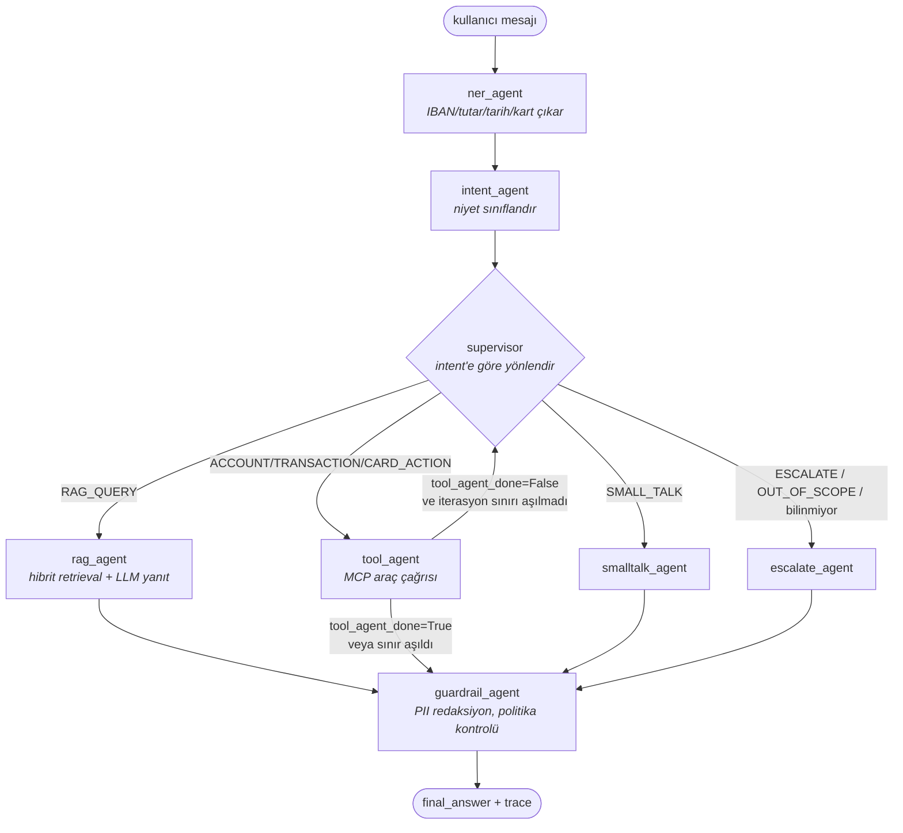

# Mimari

## Genel bakış

Sistem, kullanıcı mesajını tek bir LLM çağrısına değil, her biri tek bir sorumluluğu
olan **düğümlerden** oluşan bir [LangGraph](https://github.com/langchain-ai/langgraph)
state machine'ine dağıtır. Paylaşılan durum (`agents/state.py::GraphState`) düğümler
arasında akar; her düğüm sadece kendi sahip olduğu alanları günceller (bkz. ADR-001).

## Düğümler ve sorumlulukları

| Düğüm | Sorumluluk | LLM kullanır mı? | Kaynak |
|---|---|---|---|
| `ner_agent` | IBAN, tutar/döviz, tarih, kart son 4 hane, hesap türü çıkarımı | Hayır (regex) | `src/nlp/ner_extractor.py` |
| `intent_agent` | 7 sınıftan niyet sınıflandırma | Fake modda hayır, gerçek modda evet (yapılandırılmış çıktı + kural tabanlı fallback) | `src/nlp/intent_classifier.py` |
| `supervisor` | Rota kararı + iz kaydı | Hayır (kasıtlı olarak, bkz. ADR-002) | `src/agents/supervisor.py` |
| `rag_agent` | Hibrit (vektör+BM25) retrieval + alıntılı yanıt | Evet | `src/rag/retriever.py`, `src/agents/workers/rag_agent.py` |
| `tool_agent` | Varlıklardan MCP araç çağrısı seçme/yürütme + sonucu özetleme | Evet (özet için) | `src/agents/tools/mcp_client.py`, `src/agents/workers/tool_agent.py` |
| `smalltalk_agent` | Kısa sohbet yanıtı | Evet | `src/agents/workers/smalltalk_agent.py` |
| `escalate_agent` | İnsana aktarım / kapsam dışı mesajı | Hayır | `src/agents/workers/escalate_agent.py` |
| `guardrail_agent` | PII redaksiyon, yatırım tavsiyesi engelleme, iterasyon sınırı mesajı | Hayır (bkz. ADR-006) | `src/agents/workers/guardrail_agent.py` |

## Süreç sınırları (process boundaries)

Araç sunucusu (`mcp_server`) bilinçli olarak ayrı bir süreç: iş ilanının aradığı FastMCP
entegrasyonunu gerçek bir ağ sınırıyla gösteriyor (bkz. ADR-005). Testlerde ve
`LLM_PROVIDER=fake` modunda `InProcessToolClient` bu sınırı atlayıp aynı fonksiyonları
doğrudan çağırır — ayrı bir süreç ayağa kaldırmadan hızlı, deterministik testler için.

## Gözlemlenebilirlik

- Her düğüm `AgentTraceStep` ekler (`trace` alanı, append-only reducer) → API yanıtı
  (`ChatResponse.trace`) her turn için "hangi düğüm, ne yaptı, kaç ms" bilgisini taşır.
- Yapısal loglama (`structlog`, `app/core/logging.py`) her log satırına `request_id` +
  `conversation_id` enjekte eder (`contextvars` ile) — prod'da tek bir konuşmanın loglarını
  paylaşılan bir log akışından grep'lemek mümkün.
- LangSmith tracing opsiyonel bir açma/kapama anahtarı olarak tanımlı
  (`LANGSMITH_TRACING`) ama bu demo'da varsayılan kapalı — gerçek bir dağıtımda açılması
  önerilir (bkz. README "Sınırlar / sonraki adımlar").

## Ölçeklenebilirlik notları

- API stateless (konuşma geçmişi bu demo'da her istekte istemciden gelir — gerçek bir
  üründe bu bir oturum/veritabanı katmanına taşınır, bkz. `docs/architecture.md`
  "Sınırlar"). Bu sayede `k8s/deployment.yaml` + `k8s/hpa.yaml` yatay ölçeklemeyi
  sorunsuz destekliyor.
- Vektör deposu (Chroma) tek bir `PersistentVolumeClaim` üzerinden paylaşılıyor — birden
  fazla replika aynı salt-okunur bilgi tabanını okuyor. Yazma (ingest) `scripts/seed_vectorstore.py`
  ile ayrı, çevrimdışı bir adım; API süreçleri runtime'da vektör deposuna yazmıyor.

## Sınırlar (bilinçli, YAGNI kapsamında bırakılan)

- Konuşma geçmişi kalıcı değil (in-memory/istemci taşımalı) — gerçek ürün: Redis/Postgres.
- `tool_agent` tek turda tek araç çağrısı yapıyor (çok adımlı planlama yok) — grafiğin
  döngü mekanizması buna hazır, sadece `tool_agent_done=False` bırakmak yeterli olurdu;
  bu demo kapsamında tek adım yeterli görüldü.
- NER kural tabanlı (regex) — üretimde ek bir istatistiksel/LLM NER katmanı recall'u
  artırır, ama deterministik çekirdek test edilebilirlik için tercih edildi.
