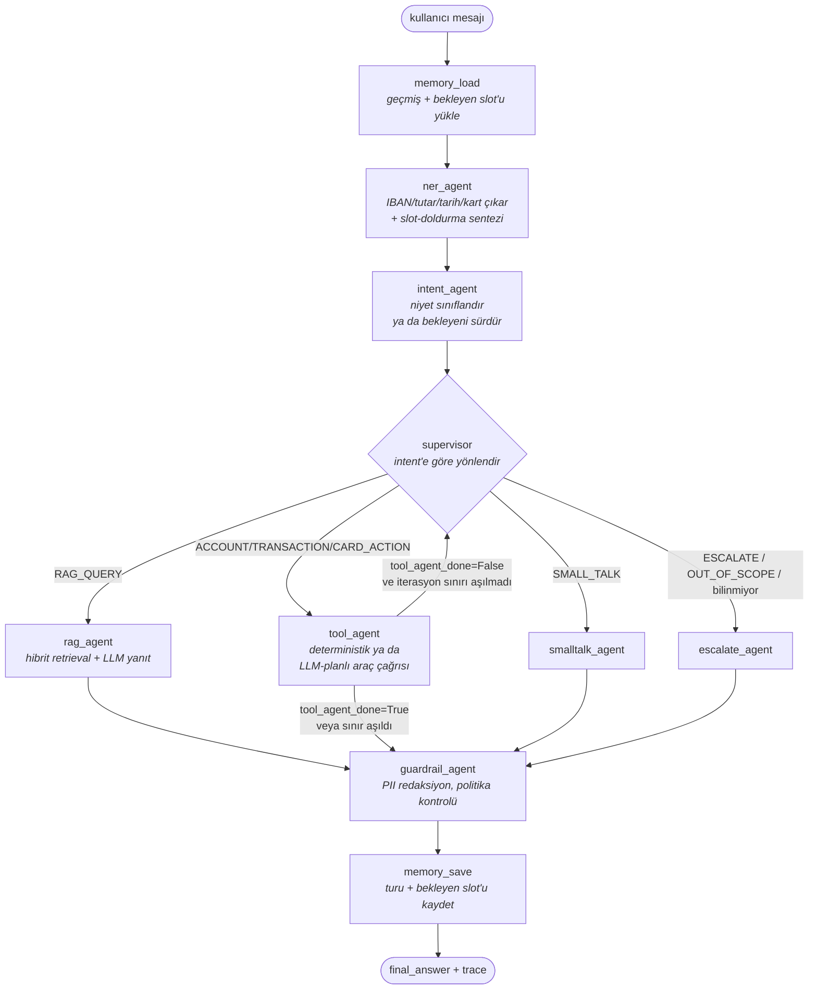
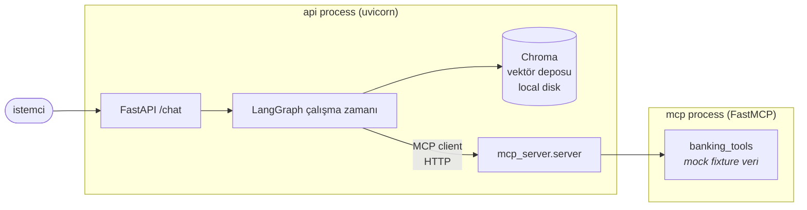

# Mimari

## Genel bakış

Sistem, kullanıcı mesajını tek bir LLM çağrısına değil, her biri tek bir sorumluluğu
olan **düğümlerden** oluşan bir [LangGraph](https://github.com/langchain-ai/langgraph)
state machine'ine dağıtır. Paylaşılan durum (`agents/state.py::GraphState`) düğümler
arasında akar; her düğüm sadece kendi sahip olduğu alanları günceller (bkz. ADR-001).

## Düğümler ve sorumlulukları

| Düğüm | Sorumluluk | LLM kullanır mı? | Kaynak |
|---|---|---|---|
| `memory_load` | Redis'ten (ya da in-memory fallback) geçmiş turları + bekleyen slot-doldurma isteğini yükle | Hayır | `src/agents/memory.py`, `src/agents/workers/memory_agent.py` |
| `ner_agent` | IBAN, tutar/döviz, tarih, kart son 4 hane, hesap türü çıkarımı + bekleyen bir slot varsa bariz cevabı sentezleme | Hayır (regex) | `src/nlp/ner_extractor.py`, `src/agents/memory.py::synthesize_bare_answer_entity` |
| `intent_agent` | 7 sınıftan niyet sınıflandırma; bekleyen slot cevaplandıysa niyeti yeniden sınıflandırmadan sürdürür | Fake modda hayır, gerçek modda evet (yapılandırılmış çıktı + kural tabanlı fallback) | `src/nlp/intent_classifier.py` |
| `supervisor` | Rota kararı + iz kaydı | Hayır (kasıtlı olarak, bkz. ADR-002) | `src/agents/supervisor.py` |
| `rag_agent` | Hibrit (vektör+BM25) retrieval + alıntılı yanıt (geçmişi bağlam olarak kullanır) | Evet | `src/rag/retriever.py`, `src/agents/workers/rag_agent.py` |
| `tool_agent` | Fake modda deterministik intent→araç eşlemesi; gerçek modda `bind_tools` ile çok-araçlı bir akıl yürütme döngüsü (argüman doğrulamalı) | Evet | `src/agents/tools/mcp_client.py`, `src/agents/workers/tool_agent.py` |
| `smalltalk_agent` | Kısa sohbet yanıtı (geçmişi bağlam olarak kullanır) | Evet | `src/agents/workers/smalltalk_agent.py` |
| `escalate_agent` | İnsana aktarım / kapsam dışı mesajı | Hayır | `src/agents/workers/escalate_agent.py` |
| `guardrail_agent` | PII redaksiyon, yatırım tavsiyesi engelleme, iterasyon sınırı mesajı | Hayır (bkz. ADR-006) | `src/agents/workers/guardrail_agent.py` |
| `memory_save` | Bu turu (+ varsa yeni bekleyen slot isteğini) Redis'e/hafızaya yaz | Hayır | `src/agents/memory.py`, `src/agents/workers/memory_agent.py` |

## Süreç sınırları (process boundaries)

Araç sunucusu (`mcp_server`) bilinçli olarak ayrı bir süreç: iş ilanının aradığı FastMCP
entegrasyonunu gerçek bir ağ sınırıyla gösteriyor (bkz. ADR-005). Testlerde ve
`LLM_PROVIDER=fake` modunda `InProcessToolClient` bu sınırı atlayıp aynı fonksiyonları
doğrudan çağırır — ayrı bir süreç ayağa kaldırmadan hızlı, deterministik testler için.

## Gözlemlenebilirlik

- Her düğüm `AgentTraceStep` ekler (`trace` alanı, append-only reducer) → API yanıtı
  (`ChatResponse.trace`) her turn için "hangi düğüm, ne yaptı, kaç ms" bilgisini taşır.
- Yapısal loglama (`structlog`, `app/core/logging.py`) her log satırına `request_id` +
  `conversation_id` enjekte eder (`contextvars` ile) — prod'da tek bir konuşmanın loglarını
  paylaşılan bir log akışından grep'lemek mümkün.
- Her istek/yanıt bir `X-Request-Id` header'ı taşır (`RequestIdMiddleware`, `app/main.py`) —
  istemci kendi id'sini verirse aynen yansıtılır, vermezse üretilir; loglardaki
  `request_id` ile birebir eşleşir.
- `GET /metrics`, `prometheus-fastapi-instrumentator` ile istek sayısı/gecikme
  histogramını Prometheus formatında sunar. Bu demo'da kimliksiz (auth'suz) —
  gerçek bir dağıtımda cluster'ın iç ağına kapatılıp Prometheus'un oradan
  scrape etmesi beklenir, `/chat` ile aynı public dinleyicide durmaz.
- LangSmith tracing opsiyonel bir açma/kapama anahtarı olarak tanımlı
  (`LANGSMITH_TRACING`) ama bu demo'da varsayılan kapalı — gerçek bir dağıtımda açılması
  önerilir (bkz. README "Sınırlar / sonraki adımlar").

## Dayanıklılık ve kötüye kullanım koruması

- `POST /chat`, `slowapi` ile IP başına `CHAT_RATE_LIMIT` (varsayılan `20/dakika`)
  sınırlı; aşıldığında `429` + `RATE_LIMITED` döner (bkz. ADR-007).
- `rag_agent`/`smalltalk_agent`/`tool_agent`'ın LLM çağrıları `app/core/llm.py::safe_ainvoke`
  ile sarmalı: bir sağlayıcı hatası (timeout, rate limit, 5xx) turu 500'e düşürmek yerine
  guardrail'in `NO_DRAFT_PRODUCED` yoluna zarifçe düşürür.

## Ölçeklenebilirlik notları

- API süreci kendisi stateless — turlar arası durum (konuşma geçmişi, bekleyen
  slot-doldurma isteği) `memory_load`/`memory_save` üzerinden Redis'te tutuluyor (bkz.
  ADR-008), API süreçlerinin belleğinde değil. Bu sayede `k8s/deployment.yaml` +
  `k8s/hpa.yaml` yatay ölçeklemeyi sorunsuz destekliyor — hangi replikanın isteği
  aldığı önemli değil, hepsi aynı Redis'i paylaşıyor. `REDIS_URL` boşsa (yerel
  geliştirme/testler) her replika kendi in-memory dict'ine düşer — o zaman konuşma
  sürekliliği yalnızca tek bir process içinde garanti.
- Vektör deposu (Chroma) tek bir `PersistentVolumeClaim` üzerinden paylaşılıyor — birden
  fazla replika aynı salt-okunur bilgi tabanını okuyor. Yazma (ingest) `scripts/seed_vectorstore.py`
  ile ayrı, çevrimdışı bir adım; API süreçleri runtime'da vektör deposuna yazmıyor.

## Sınırlar (bilinçli, YAGNI kapsamında bırakılan)

- Redis'te kalıcılık (persistence) yok — bir konuşma önbelleği, bir veritabanı değil;
  `CONVERSATION_TTL_SECONDS` zaten unutmayı bekliyor (bkz. ADR-008).
- `tool_agent`'ın LLM-planlı yolu (ADR-009) tek turn içinde birden çok aracı
  sıralayabiliyor, ama turlar arası çok adımlı bir plan (örn. "önce bakiyeme bak, düşükse
  bir uyarı kur") hâlâ yok — grafiğin döngü mekanizması buna hazır, bu demo'nun kapsamı
  dışında bırakıldı.
- NER kural tabanlı (regex) — üretimde ek bir istatistiksel/LLM NER katmanı recall'u
  artırır, ama deterministik çekirdek test edilebilirlik için tercih edildi.
